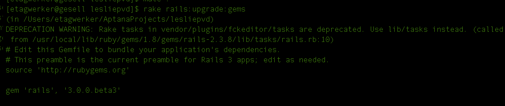

!SLIDE full-page
# De Rails 2.3.x
# a Rails 3.0.6

!SLIDE bullets incremental full-page
# Pasos #

* Tests
* Instalar rails_upgrade
* rake rails:upgrade:check
* Solucionar Issues
* Correr Tests

!SLIDE full-page

# Tests #

!SLIDE full-page

# Instalar rails_upgrade #

<code>
  script/plugin install git://github.com/rails/rails_upgrade.git
</code>

!SLIDE full-page

# Source #

[http://omgbloglol.com/post/353978923/the-path-to-rails-3-approaching-the-upgrade](http://omgbloglol.com/post/353978923/the-path-to-rails-3-approaching-the-upgrade)

!SLIDE full-page

# rake rails:upgrade:check

!SLIDE full-page

# rake rails:upgrade:gems

!SLIDE full-page

# rake rails:upgrade:routes

!SLIDE full-page

# find(:all) + find(:first) deprecated

!SLIDE full-page

# foo.find(:all) => foo.all

!SLIDE full-page

# cambios de constantes

!SLIDE full-page

# nueva implementación de mailer

!SLIDE full-page

# app/mailers/my_mailer.rb

!SLIDE full-page

# gem install rails

!SLIDE full-page

# como dice borat

!SLIDE full-page

# overwrite paso por paso

!SLIDE full-page

# rails server, y..?

!SLIDE full-page

# encoding: utf-8

!SLIDE full-page

# missing mysql2? 

!SLIDE full-page

# gem 'mysql2'

!SLIDE bullets incremental full-page

# Test checklist: #

* rails server
* Correr tests
* Actualizar gems
* Correr tests

!SLIDE full-page

# Muchas gracias!

<code>http://github.com/etagwerker</code>

<code>http://twitter.com/_nesto</code>